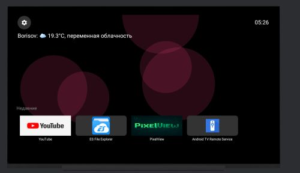
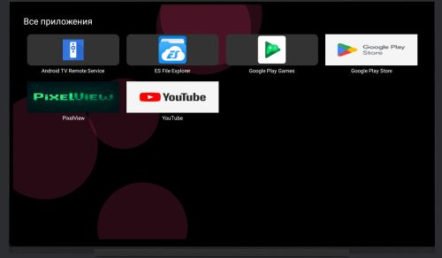

<h1 align="center">📺 PixelView</h1>

  <strong>Настраиваемый лаунчер для Android TV</strong> 
  <em>Минимализм, скорость и стиль — всё, что нужно твоему ТВ.</em>

  

  
  
  

---

## ✨ Возможности

- 🎨 Настройка темы и акцентного цвета  
- 📁 Вкладки "Все приложения" и "Недавние"  
- 🌍 Виджеты с погодой и временем  
- 📱 Интерфейс в стиле Material  
- ⚡ Лёгкий и быстрый лаунчер  

---

## 📸 Скриншоты

| Главный экран | Все приложения |
|---------------|-----------------|
|  |  |

---

## ⚙️ Установка

Скачай `.apk` с [Releases](https://github.com/PixelSmith-tech/PixelView/releases)  

---

## 🐞 Сообщение об ошибках и предложениях

Если вы нашли ошибку или хотите предложить улучшение, пожалуйста, используйте [GitHub Issues](https://github.com/PixelSmith-tech/PixelView/issues) для отчётов и обсуждений.

Также вы можете написать нам на почту: **dev@pixelsmith.tech** — мы всегда рады вашим сообщениям!
⚠️ Обратите внимание
Отчёты об ошибках, не соответствующие [шаблону](https://github.com/PixelSmith-tech/PixelView/blob/main/bug_report_template.md) или написанные на языках, кроме английского или русского, **рассматриваться не будут.**

Спасибо, что помогаете сделать PixelView лучше! 🚀

---

## 📜 Лицензия

  
[🇷🇺 Лицензия (RU)](LICENSE_RU.md) • [🇬🇧 License (EN)](LICENSE_EN.md)

> Проект полностью бесплатный и всегда таким останется.  
> Однако исходный код частично закрыт — доступны только файлы конфигурации сборки.  
> Просим уважать нашу работу.
